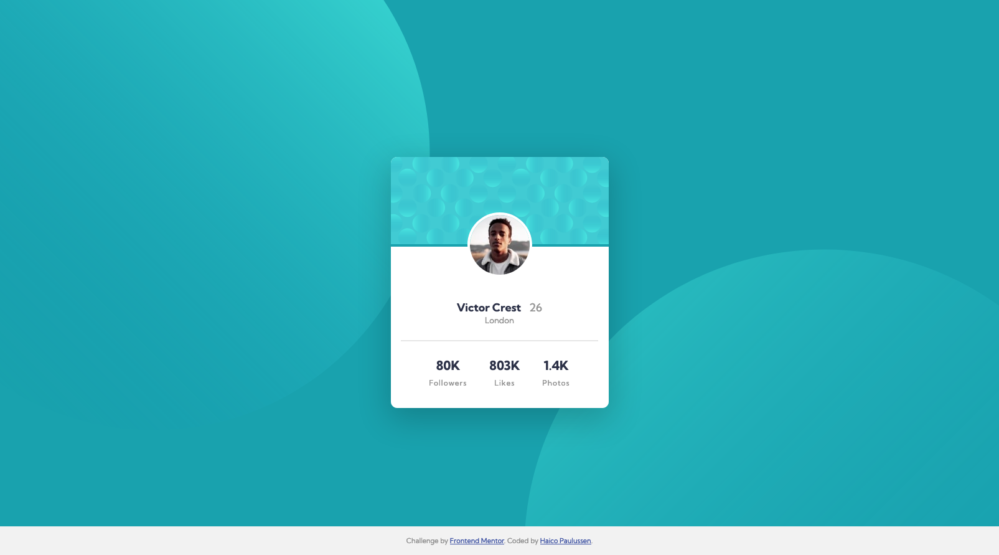

# Frontend Mentor - Profile card component solution

This is a solution to the [Profile card component challenge on Frontend Mentor](https://www.frontendmentor.io/challenges/profile-card-component-cfArpWshJ). Frontend Mentor challenges help you improve your coding skills by building realistic projects. 

## Table of contents

- [Overview](#overview)
  - [The challenge](#the-challenge)
  - [Screenshot](#screenshot)
  - [Links](#links)
- [My process](#my-process)
  - [Built with](#built-with)
  - [What I learned](#what-i-learned)
- [Author](#author)


## Overview

### The challenge

- Your challenge is to build out this profile card component and get it looking as close to the design as possible.
- You can use any tools you like to help you complete the challenge. So if you've got something you'd like to practice, feel free to give it a go.

### Screenshot



### Links

- Solution URL: [My Frontend Mentor solution](https://www.frontendmentor.io/solutions/profile-card-component-made-with-basic-html-and-css-knowledge-UZXw2e5W6)
- Live Site URL: [Github Pages](https://haico-paulussen.github.io/profile-card/)

## My process

### Built with

- HTML5
- CSS3

### What I learned

This is the first frontend programming I did in a while. So this challenge was to learn the basics again. I used little to none recources just to see how far I can come. It was a bit of a shock learning how little I still knew of CSS. But with little help of a colleague I managed to make a decent end result. 

Using the ::before and ::after pseudocode is something i'm really proud of. This was something I never used before. But it turned out to be very helpfull.  

Code snippets i'm proud of:

```css
body::before{
  content:"";
  background-image: url('images/bg-pattern-top.svg');
  height: 100%;
  width: 100%;
  background-size: contain;
  position: absolute;
  z-index: -1;
  top: -200px;
  left: -200px;
  background-repeat: no-repeat;
}

body::after{
  content:"";
  background-image: url('images/bg-pattern-bottom.svg');
  height: 100%;
  width: 60%;
  background-size: cover;
  position: absolute;
  z-index: -1;
  bottom: -400px;
  right: -200px;
}
```

### Continued development

Use this section to outline areas that you want to continue focusing on in future projects. These could be concepts you're still not completely comfortable with or techniques you found useful that you want to refine and perfect.

## Author

- Frontend Mentor - [@Haico-Paulussen](https://www.frontendmentor.io/profile/Haico-Paulussen)
- LinkedIn - [Haico Paulussen](https://www.linkedin.com/in/haico-paulussen-160281158/)

